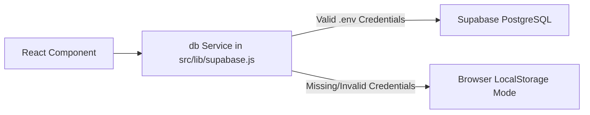
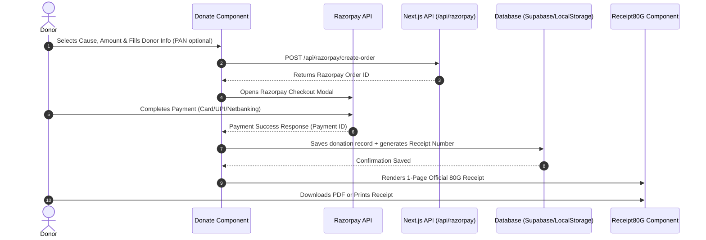

# 📘 Worlify NGO — Developer Guide & Project Flow

Welcome to **Worlify Foundation**! This document is designed to give new developers a clear, simple, and comprehensive understanding of the project's architecture, folder structure, core components, routing mechanism, and key workflows.

---

## 📌 1. Project Overview & Tech Stack

**Worlify Foundation** is a modern, responsive web application for an Indian Non-Governmental Organization (NGO) working across education, healthcare, food security, environmental conservation, and social welfare.

### 🛠️ Core Technologies:
- **Framework**: [Next.js 15](https://nextjs.org/) (App Router) with [React 19](https://react.dev/)
- **Language**: JavaScript (ES6+) & TypeScript support
- **Backend & Database**: [Supabase](https://supabase.com/) (PostgreSQL + Auth) with built-in **LocalStorage Fallback Mode** for local development without API keys
- **Payment Gateway**: [Razorpay](https://razorpay.com/) (Integration via Next.js API Routes)
- **Styling**: CSS Modules (`*.module.css`) & Global Vanilla CSS (`index.css`)
- **Icons & Animations**: [Lucide React](https://lucide.dev/) & [Motion (Framer)](https://motion.dev/)
- **AI Integration**: `@google/genai` (Google Gemini SDK)

---

## 📁 2. Folder Structure

Here is a breakdown of how the repository is structured:

```text
worlify/
├── app/                          # Next.js App Router setup (SEO & Page Wrappers)
│   ├── layout.js                 # Global Root Layout (SEO metadata, head tags, global CSS import)
│   ├── page.js                   # Homepage route handler (renders <App />)
│   ├── not-found.js              # Custom 404 page
│   ├── api/                      # Next.js Serverless API routes
│   │   └── razorpay/             # Razorpay payment endpoints
│   │       ├── create-order/     # API to create Razorpay payment order
│   │       └── debug/            # Payment debugging route
│   └── [...slug]/                # Dynamic Catch-All Route for SEO-friendly URLs
│       └── page.js               # Generates static metadata per page & loads <App />
│
├── src/                          # Core Application Code
│   ├── App.jsx                   # Main Client Router & State Manager (Tab state, Auth, Theme)
│   ├── index.css                 # Global CSS variables, reset styles, and utility classes
│   ├── main.jsx                  # React entrypoint (if using Vite/bundle wrappers)
│   │
│   ├── components/               # React Components (Pages, UI Elements, Modals)
│   │   ├── Navbar.jsx            # Top Navigation Bar & Mobile menu
│   │   ├── Home.jsx              # Main Landing Page (Hero, Stats, Impact Cards, Interactive Map)
│   │   ├── Causes.jsx            # Causes index view
│   │   ├── causes/               # Sub-components for Cause details
│   │   │   ├── CauseHero.jsx     # Header section for cause details
│   │   │   ├── CausePage.jsx     # Master wrapper for single cause view
│   │   │   ├── CauseGallery.jsx  # Cause photo gallery
│   │   │   ├── HowWeHelp.jsx     # Steps & initiatives breakdown
│   │   │   ├── ImpactStats.jsx   # Quantitative statistics
│   │   │   └── CauseCTA.jsx      # Call-to-action donate banner
│   │   ├── Campaigns.jsx         # Active & completed fundraising campaigns
│   │   ├── Donate.jsx            # Interactive Donation Portal & 80G Tax Exemption selection
│   │   ├── Receipt80G.jsx        # Printable 80G Tax Exemption Certificate format
│   │   ├── About.jsx             # About section overview
│   │   ├── OurStory.jsx          # NGO history & founding story
│   │   ├── OurMission.jsx        # Mission, vision, core values
│   │   ├── OurDirectors.jsx      # Leadership & board members
│   │   ├── Gallery.jsx           # Media gallery (Photos & Videos)
│   │   ├── Volunteer.jsx         # Volunteer application form
│   │   ├── Contact.jsx           # Contact form, office locations, Google Maps
│   │   ├── Faqs.jsx              # FAQ accordion section
│   │   ├── Legal.jsx             # Privacy, Terms, 80G/12A registration documents
│   │   ├── Auth.jsx              # User Login, Register & Password Reset portal
│   │   ├── Dashboard.jsx         # User/Admin/Coordinator Dashboard
│   │   ├── IndiaRealMap.jsx      # Interactive SVG map of India for regional work
│   │   ├── FloatingActions.jsx   # Quick actions widget (Quick Donate, WhatsApp, Scroll to top)
│   │   ├── KeysModal.jsx         # In-browser developer setup modal for Supabase keys
│   │   └── Toast.jsx             # Notification toast alerts
│   │
│   ├── data/                     # Data stores & constants
│   │   ├── causesData.js         # Content dictionary for all causes
│   │   └── campaignsData.js      # Content dictionary for active campaigns
│   │
│   ├── lib/                      # External Service Integrations
│   │   └── supabase.js           # Supabase client + Hybrid LocalStorage fallback database (`db`)
│   │
│   ├── utils/                    # Helper functions & utilities
│   │   └── numberToWords.js      # Converts numbers to words for 80G receipts (e.g., ₹5000 -> "Five Thousand")
│   │
│   └── styles/                   # Component-level CSS Modules
│       ├── Navbar.module.css
│       ├── Home.module.css
│       ├── Donate.module.css
│       ├── Receipt80G.module.css
│       ├── Dashboard.module.css
│       └── ... (matching CSS modules for each component)
│
├── public/                       # Static public assets (Favicon, OG images, verification seals)
├── .env.local                    # Environment configuration (Supabase URL, Razorpay Keys)
├── next.config.js                # Next.js configuration
├── package.json                  # NPM dependencies & scripts
└── README.md                     # Quick run instructions
```

---

## 🔄 3. Architecture & Routing Flow

Worlify uses a hybrid architecture combining **Next.js App Router for SEO** with a **Fast State-Driven Client Router** inside React.

```mermaid
flowchart TD
    A[User requests URL e.g. /causes/education] --> B[Next.js App Router: app/[...slug]/page.js]
    B --> C[Generates Server SEO Metadata title, description, canonical]
    C --> D[Loads Client App Component: src/App.jsx]
    D --> E{Reads URL & maps to activeTab state}
    E --> F[Renders corresponding component e.g. CausePage]
    F --> G[Syncs URL seamlessly via window.history.pushState]
```

### How Navigation Works:
1. **URL Mapping**: When a user clicks a menu link, `setActiveTab('causes-education')` is invoked in `src/App.jsx`.
2. **Clean URL Updates**: The browser URL changes cleanly to `/causes/education` without page reloads using HTML5 `pushState`.
3. **SEO Compatibility**: Refreshing or visiting `/causes/education` directly hits Next.js `app/[...slug]/page.js`, which injects full static SEO metadata before loading the interactive React state.

---

## 💾 4. Data Layer Architecture (Supabase + Local Mode)

The file `src/lib/supabase.js` exposes a unified database service `db`.



### Key Features of `db`:
- **Authentication**: Supports `signUp`, `signIn`, `signOut`, `getCurrentUser()`, and session recovery.
- **Role Management**:
  - `admin` (e.g., `adminworlify@gmail.com`): Access to full database records & manager controls.
  - `coordinator`: Access to volunteer submissions and cause updates.
  - `user`: General user with access to personal donation history & receipts.
- **Database Tables**:
  - `donations`: Stores donation transactions, payment status, 80G receipt numbers.
  - `volunteers`: Stores volunteer signups.
  - `contact_messages`: Stores contact form messages.

---

## 💳 5. Donation & 80G Certificate Flow

One of the most important workflows in the application is the **Donation & Tax Receipt System**:



### 📑 80G Tax Exemption Certificate Features:
- **Component**: `src/components/Receipt80G.jsx` & `src/styles/Receipt80G.module.css`
- Formatted to fit an exact single page print template.
- Includes organization registration details (80G & 12A numbers, PAN).
- Auto-converts numbers to words (e.g., ₹2,500 ➡️ *"Two Thousand Five Hundred Rupees Only"*) via `src/utils/numberToWords.js`.
- Features digital signature stamp of NGO director (Ravi Kumar Verma) and verification QR code.

---

## 📄 6. Summary of Key Pages & Components

| Page / Tab | Component | Path / Route | Purpose |
| :--- | :--- | :--- | :--- |
| **Home** | `Home.jsx` | `/` | Main landing page with impact stats, hero section, interactive India map (`IndiaRealMap.jsx`). |
| **Causes** | `Causes.jsx` / `CausePage.jsx` | `/causes` or `/causes/[id]` | Showcases NGO initiatives (Education, Healthcare, Food, Environment, etc.). |
| **Campaigns** | `Campaigns.jsx` | `/campaign` or `/campaign/[id]` | Special active fundraising campaigns (e.g., *Padhaga Har Baccha*, *Ann Seva*). |
| **Donate** | `Donate.jsx` | `/donate` | Donation portal with 80G receipt options and Razorpay payment setup. |
| **About Us** | `About.jsx`, `OurStory.jsx`, `OurMission.jsx`, `OurDirectors.jsx` | `/about`, `/about/story`, `/about/mission`, `/about/directors` | Information on organization history, team, mission, and leadership. |
| **Volunteer** | `Volunteer.jsx` | `/volunteer` | Sign-up portal for volunteers with skill selections. |
| **Gallery** | `Gallery.jsx` | `/gallery` | Photo and video grid of community drives. |
| **Contact** | `Contact.jsx` | `/contact` | Contact details, inquiry submission form, and office location map. |
| **Auth** | `Auth.jsx` | `/auth` | Login, sign up, and password reset form. |
| **Dashboard**| `Dashboard.jsx` | `/dashboard` | Protected user portal to view past donations, download 80G receipts, and manage profile. |
| **Legal** | `Legal.jsx` | `/legal` | NGO registrations (80G, 12A, NITI Aayog), Privacy Policy, and Refund Terms. |

---

## 🚀 7. Developer Quick Start

### Prerequisites
- Node.js 18.x or higher
- npm or yarn package manager

### Step-by-Step Setup

1. **Clone the repository & install dependencies**:
   ```bash
   npm install
   ```

2. **Configure Environment Variables**:
   Create a `.env.local` file in the root directory:
   ```env
   # Supabase Credentials (Optional for local testing)
   NEXT_PUBLIC_SUPABASE_URL=https://your-supabase-project.supabase.co
   NEXT_PUBLIC_SUPABASE_ANON_KEY=your-anon-key-here

   # Razorpay Credentials (Optional for local testing)
   RAZORPAY_KEY_ID=your_razorpay_key_id
   RAZORPAY_KEY_SECRET=your_razorpay_key_secret
   NEXT_PUBLIC_RAZORPAY_KEY_ID=your_razorpay_key_id
   ```
   > 💡 **Note**: If Supabase environment variables are omitted, the application automatically runs in **Local Mode**, persisting user sessions and mock data in your browser's `localStorage`.

3. **Start the local server**:
   ```bash
   npm run dev
   ```
   Open [http://localhost:3000](http://localhost:3000) in your browser.

---

## 🛠️ 8. How to Perform Common Tasks

### ➕ Adding a New Cause
1. Open `src/data/causesData.js`.
2. Add a new cause entry with an `id`, `title`, `description`, `heroImage`, `stats`, and `keyHighlights`.
3. Add the cause key (e.g. `'causes-new-cause'`) to `VALID_TABS` in `src/App.jsx`.
4. Add SEO metadata for `causes/new-cause` in `app/[...slug]/page.js` and `src/App.jsx`.

### ➕ Adding a New Component Page
1. Create your component in `src/components/MyNewPage.jsx`.
2. Create matching styles in `src/styles/MyNewPage.module.css`.
3. Import the component into `src/App.jsx`.
4. Add the tab key to `VALID_TABS` and render it inside the tab switcher switch/case block in `src/App.jsx`.

---

## 👥 Need Help?

If you encounter any issues or have questions regarding database tables, styling guidelines, or deployment:
- Check existing setup documentation in [`SUPABASE_SETUP.md`](file:///c:/Users/DELL/Downloads/Worlify/worlify/SUPABASE_SETUP.md).
- Inspect user authentication & role rules in [`src/lib/supabase.js`](file:///c:/Users/DELL/Downloads/Worlify/worlify/src/lib/supabase.js).

Happy Coding! 🚀
